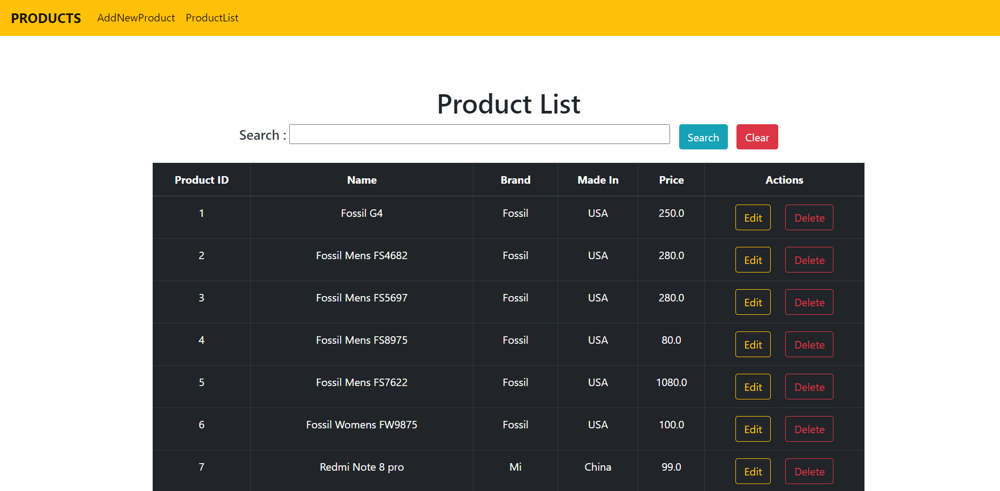
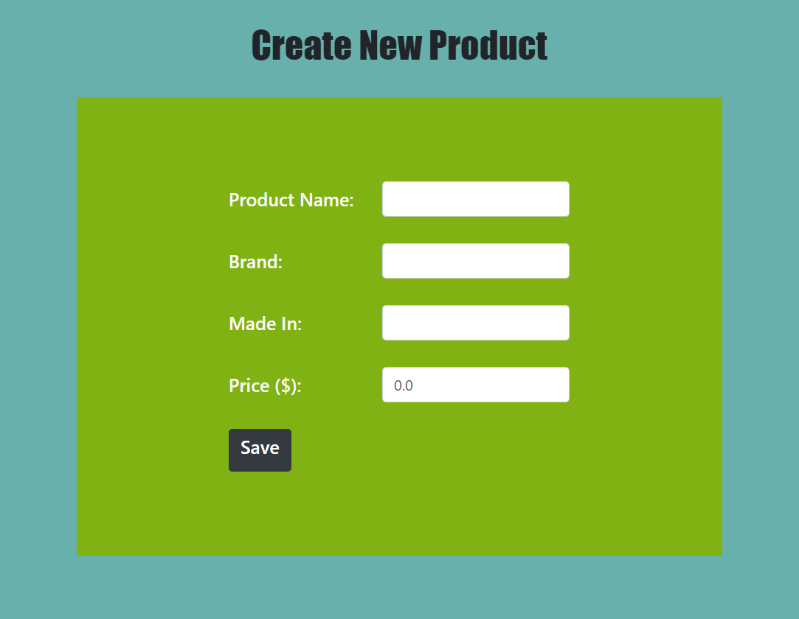
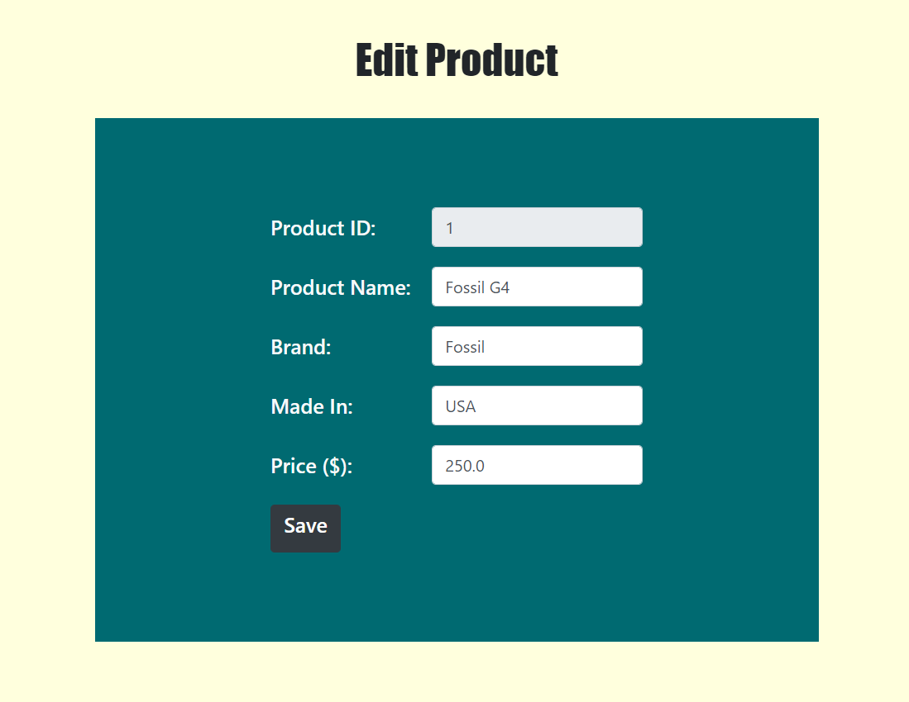
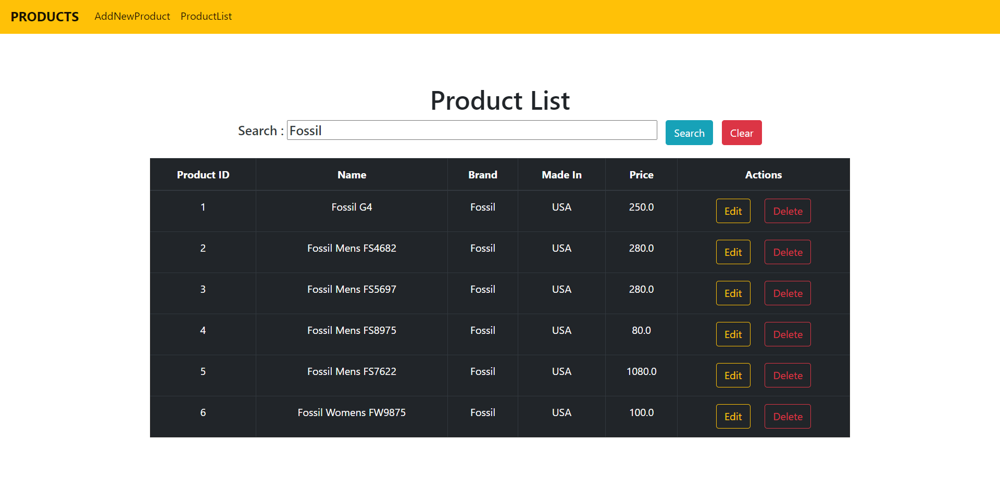

# Spring-Boot-CRUD-Example
In this Project, 
1. I have developed a Java web application that manages information in a database – with standard CRUD operations: 
Create, Retrieve, Update and Delete. 
2. Further adding and implementing filter/search functionality.

# Technologies Used:

[Spring Boot](https://spring.io/projects/spring-boot) : Spring Boot is a project that is built on the top of the Spring 
Framework. It provides an easier and faster way to set up, configure, and run both simple and web-based applications.It is a Spring module that provides the 
RAD (Rapid Application Development) feature to the Spring Framework.Spring MVC: simplifies coding the controller layer. No more boilerplate code of Java Servlet classes. 

[Spring Data JPA](https://spring.io/projects/spring-data-jpa): Simplifies coding the data access layer. No more boilerplate code of DAO classes. 

[Hibernate](https://www.infoworld.com/article/3373652/java-persistence-with-jpa-and-hibernate-part-1-entities-and-relationships.html): is used as an ORM framework – implementation of JPA. No more boilerplate JDBC code. 

[ThymeLeaf](https://www.thymeleaf.org/): simplifies coding the view layer. No more cluttered JSP and JSTL tags. 

[MySql](https://www.mysql.com/products/workbench/) : MySQL Workbench is a visual database design tool that integrates SQL 
development, administration, database design, creation and maintenance into a single integrated development environment for the 
MySQL database system.

# Screens Sample

## Product Page

## Create Product Page

## Edit Product

## Search Bar Fetch Data

# Setup Required
- Eclipse / Intellij IDE
- JDK (jdk 10 and above)
- JRE(any latest versions)
- Tomcat Server
- Web Browser(Google Crome, Mozilla Firefox, Microsoft Edge)

# Running the Project
- Clone the repository as a maven project.
- Import all the dependencies.
- Run CrudOperationsApplication.java to run the application.
- You will see the processing and verification of the process during the CrudOperationsApplication run.
- Open Browser and Type in [localhost:{server_port}/items](https://locallhost.com/).  (Server Port Depends on local System you can change it by going here [server.port](https://github.com/modhtanmay/Stock-Trading-Management/blob/master/Share-Data/src/main/resources/application.properties))
- That's it You are Good to go!!!.

Courtesy: [CodeJava](https://www.codejava.net/) For Guiding Through.
